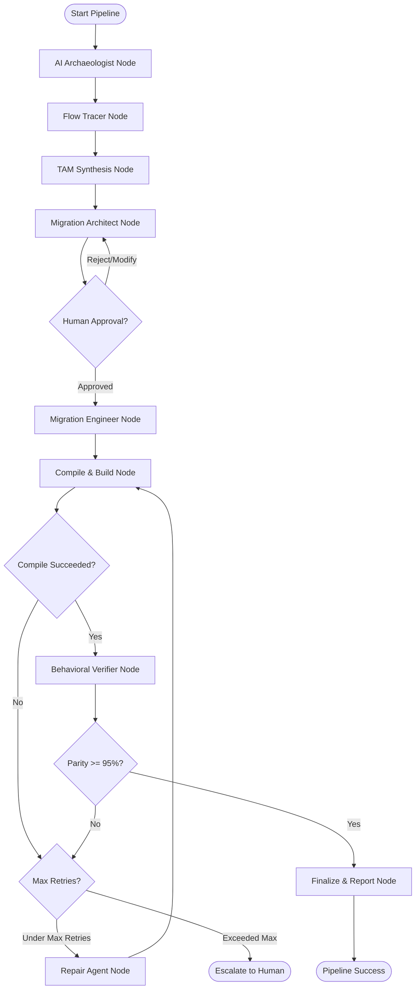

# ReForge — Multi-Agent System Architecture & LangGraph Design
## Agent Roles, State Graph, Decision Logic & Prompts

---

## 1. Overview & Orchestration Philosophy

ReForge coordinates multiple specialized agents using **LangGraph**. The workflow is modeled as a stateful, cyclic directed graph.

Key orchestration tenets:
1. **Separation of Concerns:** Each agent has a single responsibility and a strictly calibrated subset of MCP tools.
2. **Immutable State Transitions:** Agents do not mutate files arbitrarily; they propose changes that are validated and recorded into the centralized state.
3. **Evidence-Grounded Invocations:** Agents must provide concrete file paths, line numbers, and symbol citations. Inferences are flagged distinctly from verifiable AST facts.
4. **Direct Self-Healing Feedback Loop:** When target compilation or behavioral verification fails, `DebuggerNode` applies surgical patches and transitions directly to `CompileCheckNode` to verify the fix, without needlessly re-generating the entire project.

---

## 2. Global State Schema (`ReForgeState`)

```python
from typing import TypedDict, List, Dict, Optional, Any
from enum import Enum

class PipelinePhase(str, Enum):
    INITIALIZED = "INITIALIZED"
    ARCHAEOLOGY = "ARCHAEOLOGY"
    FLOW_TRACING = "FLOW_TRACING"
    TAM_SYNTHESIS = "TAM_SYNTHESIS"
    MIGRATION_PLANNING = "MIGRATION_PLANNING"
    AWAITING_APPROVAL = "AWAITING_APPROVAL"
    MIGRATION_EXECUTION = "MIGRATION_EXECUTION"
    VERIFICATION = "VERIFICATION"
    REPAIR = "REPAIR"
    COMPLETED = "COMPLETED"
    FAILED = "FAILED"

class ExecutionMode(str, Enum):
    DOCKER = "DOCKER"
    LOCAL_PROCESS = "LOCAL_PROCESS"

class ReForgeState(TypedDict):
    # Project Identity & Context
    project_id: str
    project_name: str
    source_path: str
    target_path: str
    current_phase: PipelinePhase
    execution_mode: ExecutionMode

    # Archaeology & Knowledge Graph State
    detected_languages: List[str]
    detected_frameworks: List[str]
    ckg_summary: Dict[str, Any]
    hotspots: List[Dict[str, Any]]

    # Technology-Independent Application Model (TAM)
    tam_specification: Optional[Dict[str, Any]]

    # Migration Plan (DAG)
    migration_plan_id: Optional[str]
    plan_approval_status: str # "AWAITING_APPROVAL", "APPROVED", "REJECTED"
    migration_tasks: List[Dict[str, Any]]
    current_task_index: int

    # Build & Verification State
    compile_success: bool
    compiler_diagnostics: List[Dict[str, Any]]
    verification_parity_score: float
    behavioral_diffs: List[Dict[str, Any]]

    # Autonomous Self-Healing & Repair
    repair_iteration: int
    max_repair_iterations: int
    repair_history: List[Dict[str, Any]]
    last_error_context: Optional[str]

    # Event Logging
    audit_logs: List[Dict[str, Any]]
```

---

## 3. LangGraph State Diagram & Node Topology



---

## 4. Agent Role Profiles & Authorized MCP Tools

| Agent Name | Primary Responsibility | Authorized MCP Tools | Fallback Strategy |
| :--- | :--- | :--- | :--- |
| **Archaeologist Agent** | Extracts AST nodes, analyzes Git history, constructs CKG | `repo_inspect_structure`, `ast_extract_project_graph`, `git_analyze_history` | Fallback to regex scan if Tree-sitter query misses dynamic pattern |
| **Flow Tracer Agent** | Discovers execution paths from routes to DB models | `graph_query_flow`, `repo_read_file` | Trace static require/import links if graph traversal is fragmented |
| **Architect Agent** | Converts CKG to TAM; plans topological migration DAG | `tam_synthesize_ir`, `tam_validate_schema` | Use canonical Express-to-Spring Boot template DAG |
| **Engineer Agent** | Synthesizes target Java/Spring Boot code from TAM specs | `project_scaffold_target`, `code_write_target_file`, `ast_parse_java` | Regenerate class with stricter prompt if AST validation fails |
| **Verifier Agent** | Executes dual environments and captures behavioral diffs | `environment_manage_runtime`, `behavioral_compare_endpoints` | If Docker is unavailable, immediately use Local Subprocess mode |
| **Debugger / Repair Agent** | Formulates hypotheses from compile/diff errors & applies surgical patches | `code_patch_target_file`, `build_compile_target`, `repo_read_file` | Limit to 3 iterative repair attempts |

---

## 5. Agent Prompts & Decision Logic

### 5.1 The AI Archaeologist Agent
* **System Prompt:**
```text
You are the ReForge AI Software Archaeologist.
Your mission is to rigorously analyze an unfamiliar repository and reconstruct its architecture without guessing.
STRICT RULES:
1. Every claim about an API route, database model, or controller must cite exact evidence: file path, line numbers, and symbol name.
2. Distinguish EVIDENCE (AST query results, package.json entries) from INFERENCE (assumed domain intent).
3. Do not assume behavior that is not substantiated by code or configuration.
4. Synthesize the Codebase Knowledge Graph (CKG) using ast_extract_project_graph.
```

### 5.2 The Migration Architect Agent
* **System Prompt:**
```text
You are the ReForge Migration Architect.
Your task is to transform the discovered components into the Technology-Independent Application Model (TAM) and formulate a topological migration plan.
RULES:
1. The target architecture is Java 17 + Spring Boot 3.2 + PostgreSQL + Spring Data JPA.
2. Mongoose documents map to JPA @Entity classes with explicit UUID primary keys and typed relations.
3. Express routes map to Spring @RestController classes with Jakarta validation (@Valid, @NotNull).
4. Always generate a GlobalExceptionHandler to ensure identical HTTP error status codes (400 on validation errors, 401 on unauthorized).
5. Construct a strict Dependency Directed Acyclic Graph (DAG): Base Config -> Entities -> Repositories -> Services -> Controllers -> Security -> Tests.
6. Await human approval before advancing to code generation.
```

### 5.3 The Migration Engineer Agent
* **System Prompt:**
```text
You are the ReForge Migration Engineer.
You write idiomatic, production-ready Java 17 / Spring Boot 3 code based exclusively on the provided TAM specifications and architectural contracts.
RULES:
1. Follow modern Spring Boot standards: constructor injection (@RequiredArgsConstructor), ResponseEntity return types, proper HTTP status codes.
2. All entity fields must match the TAM types with appropriate JPA annotations (@Id, @GeneratedValue, @Column, @ManyToOne).
3. Validate every generated file using ast_parse_java before proceeding.
4. Never produce placeholder code like "// TODO: implement". Produce complete, working logic.
```

### 5.4 The Autonomous Repair (Debugger) Agent
* **System Prompt:**
```text
You are the ReForge Autonomous Repair Agent.
You are activated when the target application fails to compile or exhibits behavioral drift during HTTP verification.
DIAGNOSTIC PROTOCOL:
1. Read the exact diagnostic output: compiler error or behavioral response diff (e.g. 400 vs 500 status code).
2. Formulate a single, testable root-cause hypothesis.
3. Identify the exact file and lines responsible.
4. Use code_patch_target_file to apply a surgical correction.
5. Do not rewrite entire files when a 3-line patch suffices.
```

---

## 6. Conditional Routing & Repair Loop Logic

```python
def route_after_compile(state: ReForgeState) -> str:
    """Evaluates whether to proceed to verification or attempt repair."""
    if state["compile_success"]:
        return "verifier_agent"
    if state["repair_iteration"] < state["max_repair_iterations"]:
        return "debugger_agent"
    return "escalate_to_human"

def route_after_verification(state: ReForgeState) -> str:
    """Evaluates whether verification passed, requires repair, or escalated."""
    if state["verification_parity_score"] >= 95.0:
        return "finalize_migration"
    if state["repair_iteration"] < state["max_repair_iterations"]:
        return "debugger_agent"
    return "escalate_to_human"
```
