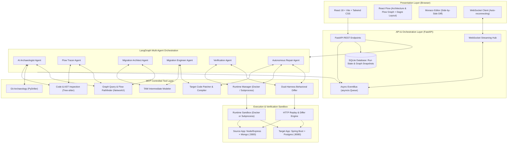
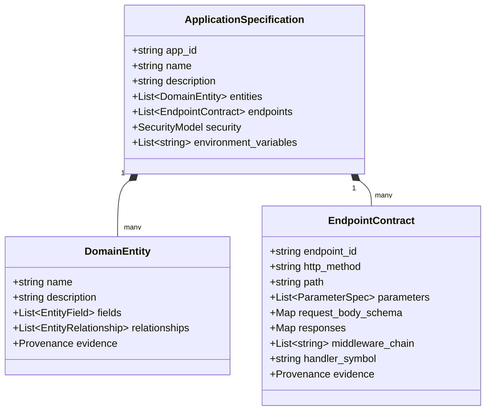
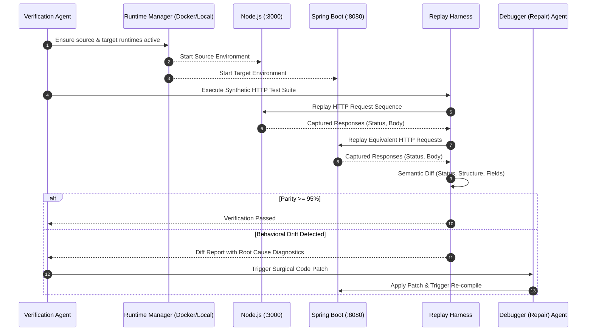

# ReForge — Autonomous Software Migration & Modernization Agent
## System Architecture Specification

---

## 1. Executive Summary & Vision

**ReForge** is an autonomous software migration and modernization system designed to eliminate the risks, hallucinations, and catastrophic errors associated with naive LLM code translation. Instead of treating code migration as a textual translation problem, ReForge applies compiler-grade software engineering principles:

$$\text{Codebase} \longrightarrow \mathbf{Archaeology} \longrightarrow \mathbf{TAM\ (IR)} \longrightarrow \mathbf{Target\ Synthesis} \longrightarrow \mathbf{Behavioral\ Verification} \longrightarrow \mathbf{Autonomous\ Repair}$$

### The Core Differentiator: Why Naive LLM Translation Fails
Standard generative code models make assumptions about hidden contracts, database schemas, middleware side effects, and edge cases. They produce code that "looks" right syntactically but fails silently at runtime. ReForge enforces a strict five-phase pipeline:
1. **UNDERSTAND (The AI Software Archaeologist):** Parse the raw codebase using deterministic AST extraction (Tree-sitter), Git history mining (PyDriller), and graph synthesis (NetworkX). Ground every insight in verifiable evidence.
2. **MODEL (Technology-Independent Application Model - TAM):** Synthesize discovered components into a framework-agnostic Intermediate Representation (IR) capturing domain entities, API contracts, execution flows, and side effects.
3. **PLAN (Architect Agent):** Generate a topological migration Dependency Graph (DAG) detailing step-by-step transformation tasks with explicit input/output contracts.
4. **MIGRATE (Engineer Agent):** Incrementally synthesize target code conforming to modern idiomatic patterns (e.g., Spring Boot 3 with Java 17, JPA, and PostgreSQL) via Model Context Protocol (MCP) tools.
5. **VERIFY & REPAIR (Verification Harness & Debugger Agent):** Execute both source and target applications (via Docker Compose or local isolated subprocesses), replay behavioral test suites and synthetic HTTP traffic, diff runtime state, and iteratively repair discrepancies.

---

## 2. Architectural Principles

### 2.1 The Intermediate Representation Principle (TAM)
*The LLM shall never translate source code directly into target code.*
Direct translation couples source language idioms to target language idioms, amplifying hallucinations. ReForge converts the source codebase into an intermediate, framework-neutral model called **TAM (Technology-Independent Application Model)**. The migration engine targets the TAM, making target generation clean, modular, and verifiable.

### 2.2 Strict Separation of Evidence and Inference
Every claim made by the Archaeologist must be classified as:
* **EVIDENCE:** Directly verifiable via an AST node, file location, Git commit, test case, or runtime trace. Evidence includes precise provenance (`source_file`, `start_line`, `end_line`, `symbol`).
* **INFERENCE:** Probabilistic deductions generated by an LLM (e.g., business intent, architectural style, security risk assessment). Inferences cite the evidence nodes on which they are based.

### 2.3 Determinism First, LLM Second
LLMs are reserved for semantic reasoning, abstraction synthesis, and code generation. Deterministic tools (Tree-sitter queries, static graph analysis, Git log parsing, schema validators, compiler passes) handle discovery, dependency resolution, topological ordering, and syntax validation.

### 2.4 Controlled Tool Interface via MCP (Model Context Protocol)
All agent interactions with the codebase, AST parsers, container runtimes, compilers, and test suites are routed through standardized **MCP Tools**. Agents have zero raw shell or unbounded filesystem access outside calibrated MCP boundaries.

### 2.5 Dual-Mode Execution Resilience
To guarantee demonstration reliability during a hackathon, the execution subsystem provides **Dual-Mode Execution**:
1. **Container Mode (Primary):** Docker Compose orchestrating isolated Node.js, MongoDB, Spring Boot, and PostgreSQL containers.
2. **Local Subprocess Mode (Resilient Fallback):** Direct process execution running Node.js on port 3000 and Spring Boot on port 8080 with embedded/local storage.

---

## 3. High-Level System Architecture

---

## 4. Subsystem Specifications

### 4.1 Frontend Presentation Layer
* **Framework:** React 18 with TypeScript and Vite for rapid development and HMR.
* **Styling:** Tailwind CSS with a dark-mode palette.
* **Graph Visualization:** `@xyflow/react` (React Flow) with `@dagrejs/dagre` for automated hierarchical layout (`Route` $\to$ `Middleware` $\to$ `Controller` $\to$ `Service` $\to$ `Model`).
* **Code Inspection:** `@monaco-editor/react` for dual-pane original-vs-migrated code comparisons with provenance evidence highlighting.
* **Real-time Protocol:** Auto-reconnecting WebSocket client streaming live agent steps, terminal compilation logs, and verification diff cards.

### 4.2 Backend API & Storage Engine
* **Framework:** FastAPI (Python 3.11+) with asynchronous endpoints and OpenAPI 3.1 documentation.
* **Event Pipeline:** In-memory asynchronous `EventBus` (`asyncio.Queue`) decoupling agent execution from WebSocket dispatching, supporting multi-subscriber broadcasting.
* **Relational Storage:** SQLite with WAL mode via SQLAlchemy async ORM. Stores projects, analyses, TAM specifications, migration plans, verification runs, and repair iterations. Knowledge Graphs are stored as complete serialized JSON snapshots inside `analysis_runs`, avoiding hundreds of individual relational table joins.
* **Semantic Code Search:** Lightweight in-memory AST symbol index and ripgrep queries, avoiding heavy machine-learning vector store dependencies.

### 4.3 Code Intelligence & AI Archaeology Engine
* **AST Parsing:** Deterministic Tree-sitter extraction passes for JavaScript/Node.js and Java. A single bulk extraction tool (`ast_extract_project_graph`) discovers all routes, models, and controllers in sub-second time.
* **Git History Mining:** PyDriller analyzes commit churn, modification frequencies, and complexity hotspots.
* **Knowledge Graph Engine:** NetworkX representing the Codebase Knowledge Graph (CKG) with typed nodes, directional edges, and verifiable provenance.

### 4.4 LangGraph Multi-Agent Orchestration
* **Stateful Graph Execution:** `ReForgeState` manages evolving pipeline context.
* **Human-in-the-Loop:** Supported via LangGraph interrupt points at the plan review stage (`HumanApprovalCheck`), resumeable via the REST API.
* **Direct Repair Cycle:** When target compilation or verification fails, `DebuggerNode` applies surgical patches and transitions directly to `CompileCheckNode` to verify the fix, without needlessly re-running the full code generator.

### 4.5 Target Demo Stack: Express to Spring Boot

| Architectural Concern | Source Platform (Node.js) | Target Platform (Java / Spring Boot) |
| :--- | :--- | :--- |
| **Language & Runtime** | JavaScript (Node.js 18+) | Java 17 / OpenJDK 17 |
| **Framework** | Express.js 4.x | Spring Boot 3.2.x |
| **Persistence / ORM** | MongoDB + Mongoose 7/8 | PostgreSQL 16 + Spring Data JPA |
| **API Architecture** | Imperative route handlers (`router.post()`) | Declarative `@RestController` + `@RequestMapping` |
| **Validation** | Schema rules / express-validator | Jakarta Bean Validation (`@Valid`, `@NotNull`) |
| **Exception Handling** | Custom error middleware | `@RestControllerAdvice` Global Exception Handler |
| **Configuration** | `dotenv` (`process.env`) | `application.yml` |
| **Dependency Injection** | CommonJS `require()` / ES `import` | Spring IoC (`@Service`, `@Repository`, `@RequiredArgsConstructor`) |
| **Testing** | Jest + Supertest | JUnit 5 + MockMvc / AssertJ |
| **Build System** | `npm` / `package.json` | Apache Maven (`pom.xml` with pre-warmed wrapper) |

---

## 5. Technology-Independent Application Model (TAM)

---

## 6. Behavioral Verification & Repair Engine

---

## 7. Security & Sandboxing Boundaries

1. **Filesystem Confinement:** All file operations (`repo_read_file`, `code_write_target_file`, `code_patch_target_file`) enforce strict path sandboxing: target paths must strictly resolve within `/storage/workspaces/{project_id}/`.
2. **Command Whitelisting:** Arbitrary shell execution is forbidden. Only predetermined build and test commands (`mvn test-compile`, `npm test`) are executable through calibrated MCP tools.
3. **Secrets Redaction:** The Archaeologist strips sensitive credentials (JWT secrets, DB connection strings) discovered in `.env` files before forwarding context to LLM prompts.
