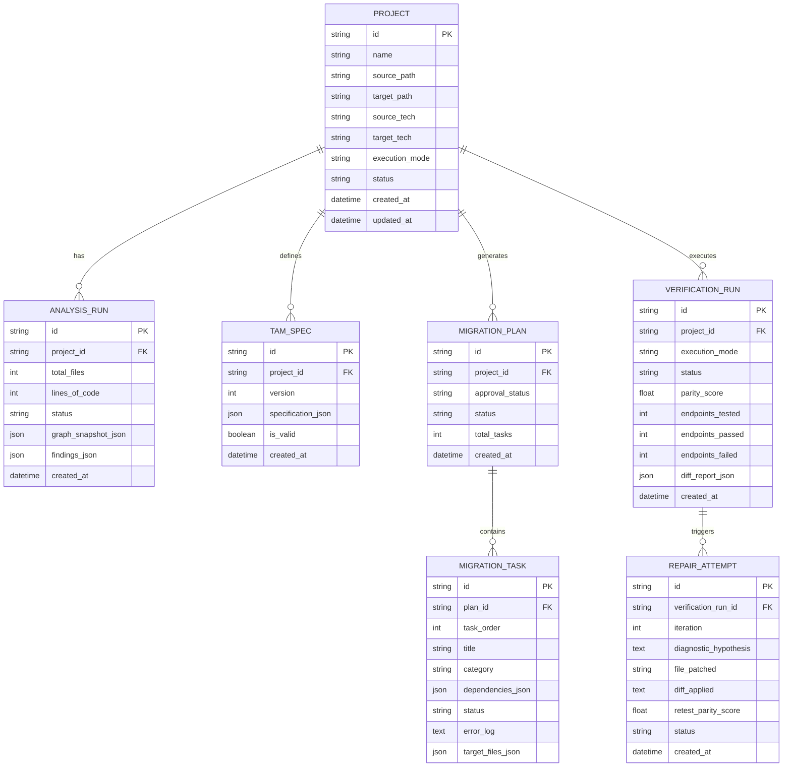

# ReForge — Data Model & Schema Specification
## Relational Storage, Knowledge Graph & TAM Schema

---

## 1. Overview & Data Architecture

ReForge coordinates three interconnected data layers:
1. **Relational Metadata Store (SQLite / SQLAlchemy Async):** Tracks projects, analysis runs, graph snapshots, migration plans, verification runs, and repair iterations.
2. **Codebase Knowledge Graph (CKG - NetworkX / React Flow):** Graph representation of parsed AST entities, dependencies, execution flows, and evidence provenance, stored as a complete serialized snapshot inside `analysis_runs`.
3. **Technology-Independent Application Model (TAM):** Pydantic v2 domain model capturing the semantic specification of the software independent of source or target frameworks.

---

## 2. Relational Database Schema (SQLite)



---

## 3. Codebase Knowledge Graph (CKG) Schema

### 3.1 Node Types & Labels
* `ROUTE`: Represents HTTP endpoints (e.g., `POST /api/tasks`).
* `CONTROLLER`: Route handler functions and controller classes.
* `SERVICE`: Domain logic services.
* `MODEL`: Data models and schemas (e.g., Mongoose Schema or JPA Entity).
* `FIELD`: Attributes belonging to a domain model.
* `MIDDLEWARE`: Authentication, logging, or error handlers.
* `CONFIG`: Environment variables, connection strings, or configuration files.
* `TEST`: Automated test suites and test cases.

### 3.2 Edge Types & Semantics
* `HANDLES_ROUTE`: `ROUTE` $\to$ `CONTROLLER`
* `USES_MIDDLEWARE`: `ROUTE` $\to$ `MIDDLEWARE`
* `CALLS`: `CONTROLLER` $\to$ `SERVICE`
* `USES_MODEL`: `CONTROLLER` or `SERVICE` $\to$ `MODEL`
* `HAS_FIELD`: `MODEL` $\to$ `FIELD`
* `READS_CONFIG`: `SERVICE` or `CONTROLLER` $\to$ `CONFIG`
* `TESTS`: `TEST` $\to$ `ROUTE` or `SERVICE`

### 3.3 Node Data & Evidence Provenance Structure
Every CKG node encapsulates verifiable evidence:

```json
{
  "node_id": "route_post_tasks",
  "node_type": "ROUTE",
  "label": "POST /api/tasks",
  "metadata": {
    "http_method": "POST",
    "path": "/api/tasks",
    "auth_required": true
  },
  "evidence": {
    "source_file": "routes/taskRoutes.js",
    "start_line": 14,
    "end_line": 14,
    "symbol": "router.post('/', auth, taskController.createTask)",
    "ast_type": "call_expression",
    "evidence_type": "AST",
    "confidence": 1.0
  }
}
```

---

## 4. Technology-Independent Application Model (TAM)

```python
from pydantic import BaseModel, Field
from typing import List, Dict, Optional
from enum import Enum

class DataType(str, Enum):
    STRING = "STRING"
    INTEGER = "INTEGER"
    DECIMAL = "DECIMAL"
    BOOLEAN = "BOOLEAN"
    UUID = "UUID"
    DATETIME = "DATETIME"
    ENUM = "ENUM"
    JSON = "JSON"

class RelationType(str, Enum):
    ONE_TO_ONE = "ONE_TO_ONE"
    ONE_TO_MANY = "ONE_TO_MANY"
    MANY_TO_ONE = "MANY_TO_ONE"
    MANY_TO_MANY = "MANY_TO_MANY"

class EntityField(BaseModel):
    name: str
    data_type: DataType
    primary_key: bool = False
    required: bool = True
    unique: bool = False
    max_length: Optional[int] = None
    default_value: Optional[str] = None
    enum_values: Optional[List[str]] = None

class EntityRelationship(BaseModel):
    target_entity: str
    relation_type: RelationType
    foreign_key_field: str
    cascade_delete: bool = False

class DomainEntity(BaseModel):
    name: str
    description: Optional[str] = None
    fields: List[EntityField]
    relationships: List[EntityRelationship] = []

class HttpMethod(str, Enum):
    GET = "GET"
    POST = "POST"
    PUT = "PUT"
    PATCH = "PATCH"
    DELETE = "DELETE"

class ParameterSpec(BaseModel):
    name: str
    in_location: str = "query" # "query", "path", "header"
    data_type: DataType
    required: bool = True

class EndpointContract(BaseModel):
    endpoint_id: str
    http_method: HttpMethod
    path: str
    summary: Optional[str] = None
    auth_required: bool = False
    parameters: List[ParameterSpec] = []
    request_body_schema: Optional[Dict] = None
    responses: Dict[int, Dict] = {} # e.g. {200: {"description": "..."}, 400: {...}}

class ApplicationSpecification(BaseModel):
    app_id: str
    name: str
    version: str = "1.0.0"
    entities: List[DomainEntity]
    endpoints: List[EndpointContract]
    environment_variables: List[str] = []
```

---

## 5. Behavioral Diff & Verification Data Model

```python
class EndpointComparisonResult(BaseModel):
    endpoint: str
    method: HttpMethod
    request_payload: Optional[Dict] = None

    # Source (Node.js) Response
    source_status: int
    source_headers: Dict[str, str]
    source_body: Optional[Dict] = None

    # Target (Spring Boot) Response
    target_status: int
    target_headers: Dict[str, str]
    target_body: Optional[Dict] = None

    # Behavioral Parity Metrics
    status_match: bool
    schema_match: bool
    semantic_match: bool
    discrepancies: List[str] = []
    root_cause_hint: Optional[str] = None

class VerificationReport(BaseModel):
    run_id: str
    execution_mode: str # "DOCKER" or "LOCAL_PROCESS"
    total_endpoints: int
    passed_endpoints: int
    failed_endpoints: int
    parity_score: float # Formula: (passed_endpoints / total_endpoints) * 100
    details: List[EndpointComparisonResult]
```
