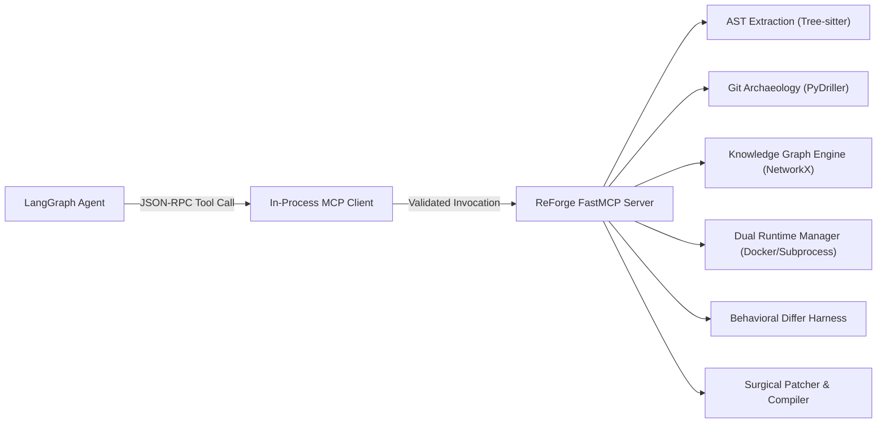

# ReForge — Model Context Protocol (MCP) Tool Specification
## Controlled Agent Tool Layer & Sandbox Interface

---

## 1. Architectural Purpose & MCP Design

In ReForge, **no LLM or agent has direct, unconstrained access to the host operating system, raw shell, or unvalidated filesystem.**

All interactions with codebases, syntax trees, compilers, execution runtimes, and test harnesses are mediated through the **Model Context Protocol (MCP)**. This guarantees:
1. **Auditability:** Every tool invocation has a typed request, schema-validated parameters, and deterministic JSON response logged to SQLite.
2. **Determinism:** LLM hallucinations are rejected by schema validation before reaching the operating system.
3. **Sandboxing:** File reads, writes, and commands are strictly confined to `/storage/workspaces/{project_id}/`.
4. **Performance:** Heavy operations (e.g. AST parsing of all files) run as single deterministic bulk tools rather than dozens of chatty LLM roundtrips.



---

## 2. Complete MCP Tool Catalog

### 2.1 Repository & Code Inspection Tools

#### `repo_inspect_structure`
Scans a project workspace, identifies languages, detects build systems (`package.json`, `pom.xml`), and produces a filtered file tree.
* **Input Schema:**
```json
{
  "project_id": { "type": "string", "description": "Unique project identifier" },
  "max_depth": { "type": "integer", "default": 5 },
  "ignore_patterns": { "type": "array", "items": { "type": "string" }, "default": ["node_modules", ".git", "target", "dist"] }
}
```
* **Output Schema:**
```json
{
  "root_path": "/storage/workspaces/proj_123/source",
  "project_type": "NODE_EXPRESS",
  "detected_frameworks": ["Express", "Mongoose", "Jest"],
  "file_tree": [
    { "path": "server.js", "size": 1240, "extension": "js" },
    { "path": "routes/taskRoutes.js", "size": 890, "extension": "js" }
  ]
}
```

#### `repo_read_file`
Safely reads file contents within the project directory with line boundary bounds and sandbox checks.
* **Input Schema:**
```json
{
  "project_id": { "type": "string" },
  "relative_path": { "type": "string", "description": "Workspace-relative file path" },
  "start_line": { "type": "integer", "default": 1 },
  "end_line": { "type": "integer", "default": 500 }
}
```
* **Output Schema:**
```json
{
  "file_path": "routes/taskRoutes.js",
  "total_lines": 35,
  "content": "const express = require('express');\nconst router = express.Router();...",
  "checksum": "sha256:abcd1234..."
}
```

---

### 2.2 AST & Archaeology Tools

#### `ast_extract_project_graph`
Performs a deterministic, high-speed Tree-sitter pass across all JavaScript files in the project. Extracts routes, middleware bindings, Mongoose schemas, controllers, and functions, and synthesizes the NetworkX Codebase Knowledge Graph (CKG).
* **Input Schema:**
```json
{
  "project_id": { "type": "string" }
}
```
* **Output Schema:**
```json
{
  "nodes_count": 14,
  "edges_count": 18,
  "routes_found": [
    {
      "method": "POST",
      "path": "/api/tasks",
      "source_file": "routes/taskRoutes.js",
      "line": 14,
      "middleware": ["auth"],
      "controller_symbol": "taskController.createTask"
    }
  ],
  "models_found": [
    {
      "name": "Task",
      "source_file": "models/Task.js",
      "line": 5,
      "fields": ["title", "status", "priority", "user"]
    }
  ]
}
```

#### `ast_parse_java`
Validates Java syntax using Tree-sitter Java parser, extracting class names, annotations, and verifying syntactic correctness before compiling.
* **Input Schema:**
```json
{
  "project_id": { "type": "string" },
  "file_path": { "type": "string" }
}
```
* **Output Schema:**
```json
{
  "file_path": "src/main/java/com/reforge/app/controller/TaskController.java",
  "is_valid_syntax": true,
  "class_name": "TaskController",
  "annotations": ["@RestController", "@RequestMapping(\"/api/tasks\")"],
  "syntax_errors": []
}
```

---

### 2.3 Git History Tools

#### `git_analyze_history`
Mines commit logs, churn rates, and complexity hotspots using PyDriller.
* **Input Schema:**
```json
{
  "project_id": { "type": "string" },
  "max_commits": { "type": "integer", "default": 100 }
}
```
* **Output Schema:**
```json
{
  "total_commits_analyzed": 45,
  "hotspots": [
    { "file": "controllers/taskController.js", "modifications": 22, "churn": 340 }
  ]
}
```

---

### 2.4 Knowledge Graph Tools

#### `graph_query_flow`
Traces shortest path and dependency connections between an incoming HTTP route and the underlying database model.
* **Input Schema:**
```json
{
  "project_id": { "type": "string" },
  "source_route": { "type": "string", "description": "e.g. POST /api/tasks" }
}
```
* **Output Schema:**
```json
{
  "path_found": true,
  "steps": [
    { "node_id": "route_post_tasks", "type": "ROUTE", "label": "POST /api/tasks" },
    { "node_id": "mw_auth", "type": "MIDDLEWARE", "label": "auth" },
    { "node_id": "ctrl_create_task", "type": "CONTROLLER", "label": "taskController.createTask" },
    { "node_id": "model_task", "type": "MODEL", "label": "Task" }
  ]
}
```

---

### 2.5 Code Generation & Modification Tools

#### `project_scaffold_target`
Copies the verified Spring Boot 3 + Maven skeleton into the target workspace with pre-warmed dependencies and base configuration.
* **Input Schema:**
```json
{
  "project_id": { "type": "string" },
  "package_name": { "type": "string", "default": "com.reforge.app" }
}
```
* **Output Schema:**
```json
{
  "target_directory": "/storage/workspaces/proj_123/target",
  "status": "SCAFFOLDED",
  "files_created": ["pom.xml", "application.yml", "Application.java", "GlobalExceptionHandler.java"]
}
```

#### `code_write_target_file`
Writes a synthesized target Java file with package verification and syntax validation.
* **Input Schema:**
```json
{
  "project_id": { "type": "string" },
  "relative_path": { "type": "string", "description": "e.g. src/main/java/com/reforge/app/model/Task.java" },
  "content": { "type": "string" },
  "overwrite": { "type": "boolean", "default": true }
}
```
* **Output Schema:**
```json
{
  "file_path": "src/main/java/com/reforge/app/model/Task.java",
  "bytes_written": 1820,
  "syntax_valid": true
}
```

#### `code_patch_target_file`
Applies a surgical line or block replacement to a target file during autonomous repair.
* **Input Schema:**
```json
{
  "project_id": { "type": "string" },
  "relative_path": { "type": "string" },
  "search_block": { "type": "string" },
  "replace_block": { "type": "string" }
}
```
* **Output Schema:**
```json
{
  "file_path": "src/main/java/com/reforge/app/exception/GlobalExceptionHandler.java",
  "patch_applied": true,
  "syntax_valid": true
}
```

---

### 2.6 Build, Execution & Verification Tools

#### `build_compile_target`
Invokes the Maven compiler wrapper (`./mvnw clean test-compile`) inside the target directory and parses compiler error messages into structured diagnostics.
* **Input Schema:**
```json
{
  "project_id": { "type": "string" },
  "offline_mode": { "type": "boolean", "default": true }
}
```
* **Output Schema:**
```json
{
  "success": true,
  "exit_code": 0,
  "diagnostics": []
}
```

#### `environment_manage_runtime`
Controls application execution environments in either Docker Compose mode or Local Subprocess mode.
* **Input Schema:**
```json
{
  "project_id": { "type": "string" },
  "action": { "type": "string", "enum": ["START", "STOP", "STATUS"] },
  "mode": { "type": "string", "enum": ["DOCKER", "LOCAL_PROCESS"], "default": "LOCAL_PROCESS" }
}
```
* **Output Schema:**
```json
{
  "status": "RUNNING",
  "mode": "LOCAL_PROCESS",
  "source_url": "http://localhost:3000",
  "target_url": "http://localhost:8080"
}
```

#### `behavioral_compare_endpoints`
Executes an ordered sequence of HTTP requests against both running environments, normalizes transient data (timestamps, UUIDs), and computes semantic behavioral parity.
* **Input Schema:**
```json
{
  "project_id": { "type": "string" },
  "requests": [
    {
      "method": "POST",
      "path": "/api/tasks",
      "headers": { "Content-Type": "application/json", "Authorization": "Bearer {{jwt_token}}" },
      "body": { "title": "Test Task", "priority": "HIGH" }
    }
  ]
}
```
* **Output Schema:**
```json
{
  "parity_score": 100.0,
  "all_matched": true,
  "comparisons": [
    {
      "endpoint": "POST /api/tasks",
      "status_match": true,
      "semantic_body_match": true,
      "diff": null
    }
  ]
}
```
